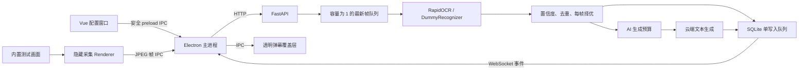

# 系统架构与阶段边界

## 当前阶段

项目已进入第 4 周候选版本：RapidOCR、单 ROI、OCR 直连 AI、SQLite 与 Windows 打包均已接入。Electron 每 250 ms 检查目标窗口边界，只在位置或尺寸变化时更新覆盖层；目标窗口连续不可用约 2 秒后安全停止会话。

## 职责

| 模块 | 唯一职责 | 阻塞策略 |
|---|---|---|
| Vue 配置窗口 | 选择来源、管理 AI 生成策略、启停会话、展示状态 | 不执行图像与网络工作 |
| Electron 主进程 | 子进程、认证、HTTP/WebSocket、窗口编排 | 网络调用异步执行 |
| 隐藏采集 Renderer | 获取授权视频流、裁剪和 JPEG 编码 | 每秒一帧；上次上传未结束时跳过 |
| 透明覆盖层 | 展示弹幕，不参与业务决策 | CSS 动画；鼠标穿透 |
| FastAPI | 校验请求、管理会话和事件订阅 | OCR 放入单线程执行器 |
| 最新帧队列 | 每个会话只保存一个等待帧 | 新帧替换旧帧 |
| Recognizer | Dummy 与 RapidOCR 共用可替换接口 | OCR 实例生命周期内只创建一次 |
| 真实窗口生成链路 | NFKC、阈值、3 秒去重、每帧择优、全局间隔/同文/分钟预算与云端生成 | 网络失败只更新识别结论，不中断会话 |
| RuleEngine | 仅服务内置测试画面的固定模板 | 不调用云端 |
| SQLite | 六表配置与事件持久化 | 默认回滚日志、短事务、后台单写者 |

## 安全边界

- 只捕获用户主动选择的公开窗口，不注入进程、不读取游戏内存。
- Electron Renderer 启用 `contextIsolation`、禁用 `nodeIntegration`，只暴露白名单 IPC。
- Python 只监听 `127.0.0.1`，所有 HTTP/WebSocket 请求必须携带随机令牌。
- 原始帧只存在内存中，不写文件、不进入数据库；配置和结构化事件才会持久化。
