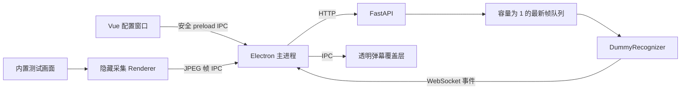

# 系统架构与阶段边界

## 当前阶段

第 1 周只验证最小纵向链路，不接入 OCR、SQLite 或云端模型。为修复覆盖层切换问题，已使用 Python 标准库 Win32 API 加入基础窗口边界查询，Electron 每 250 ms 检查一次并只在位置或尺寸变化时更新覆盖层；更完整的最小化、关闭与 DPI 跟踪仍留在第 3 周。临时状态保存在 Python 进程内，重启后清空。

## 职责

| 模块 | 唯一职责 | 阻塞策略 |
|---|---|---|
| Vue 配置窗口 | 选择来源、启停会话、展示状态 | 不执行图像与网络工作 |
| Electron 主进程 | 子进程、认证、HTTP/WebSocket、窗口编排 | 网络调用异步执行 |
| 隐藏采集 Renderer | 获取授权视频流、裁剪和 JPEG 编码 | 每秒一帧；上次上传未结束时跳过 |
| 透明覆盖层 | 展示弹幕，不参与业务决策 | CSS 动画；鼠标穿透 |
| FastAPI | 校验请求、管理会话和事件订阅 | OCR 类工作交给后台任务 |
| 最新帧队列 | 每个会话只保存一个等待帧 | 新帧替换旧帧 |
| DummyRecognizer | 为纵向链路返回可预测结果 | 第 2 周替换为 RapidOCR |

## 安全边界

- 只捕获用户主动选择的公开窗口，不注入进程、不读取游戏内存。
- Electron Renderer 启用 `contextIsolation`、禁用 `nodeIntegration`，只暴露白名单 IPC。
- Python 只监听 `127.0.0.1`，所有 HTTP/WebSocket 请求必须携带随机令牌。
- 原始帧只存在内存中，当前阶段不写文件、不写数据库。
