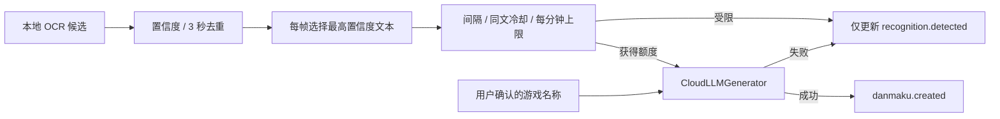

# OCR 直连云端弹幕生成

## 定位

真实窗口不再依赖关键词规则。OCR 文本通过置信度、3 秒识别去重和保守调用策略后，直接交给云端文本模型生成一条弹幕。API 未配置、被节流或调用失败时只记录识别结果和原因，不生成本地模板弹幕。内置测试画面仍使用配置级固定模板，永远不消耗 API。

## 默认调用策略

- 最低 OCR 置信度：`0.70`。
- 两次 AI 调用最小间隔：`12 秒`。
- 同一“游戏名称＋标准化 OCR 文本”冷却：`30 秒`。
- 滚动一分钟最多调用：`4 次`。
- 一帧多段有效文字都记录为识别事件，但只让最高置信度的一段申请一次额度。
- 请求开始时即占用额度，超时或失败也计数，避免错误状态持续消耗 Token。
- OCR 发往云端前截断到 300 字符；非流式输出最多 `64 token`，清洗后正文最多 60 字符。

策略保存在 Electron 用户数据目录的 `cloud-api.json`，配置版本为 v3。修改策略或云端配置会重置后端进程内的预算计数；活动会话期间禁止修改。

## 安全与隐私

- Electron 主进程通过 Windows `safeStorage` 加密 API Key；Renderer 只能看到 `hasApiKey`，不能读取密钥正文。
- 系统加密不可用时，密钥只保存在本次进程内存，界面会明确警告。
- Python 只在内存中保存 Electron 同步的密钥。
- 云端请求只包含用户确认的游戏名称和最多 300 字符 OCR 文本，不包含截图、关键词、模板、完整窗口标题、HWND 或事件历史。
- 普通日志、WebSocket 事件和 SQLite 均不记录 API Key。

## 接口与事件

所有接口继续使用 `X-DaMu-Token`。云端配置只有：

- `PUT /api/v1/generation/config`：主进程同步配置、策略和内存密钥。

项目不提供独立测试调用接口，也不再提供全局关键词规则接口。

`recognition.detected.payload.generation_evaluation.status` 可能为：

- `not_selected`、`cloud_unavailable`、`interval_limited`、`repeat_limited`、`rate_limited`；
- `calling`、`generated`、`failed`。

选中的识别事件在调用前发出 `calling`，完成后用相同 `event_id` 更新最终状态，因此控制台和 SQLite 不会产生两条重复识别记录。成功时才产生一个 `danmaku.created`，其中 `rule_id=null`、`generator="cloud"`，并可携带生成耗时、模型和服务商请求 ID。

## 使用方式

1. 停止当前捕获会话。
2. 在左侧 `AI GENERATION POLICY` 设置调用阈值和频率。
3. 在 `CLOUD GENERATOR` 点击“配置”，填写 OpenAI 兼容服务的 Base URL、API Key、模型名和系统提示词。
4. 保存并启用云端生成。
5. 选择窗口，确认游戏名称与 ROI，然后启动。
6. 最近事件会显示“已提交 AI”“相同文字冷却中”“AI 未配置”或明确失败原因；只有成功结果才进入覆盖层。

SQLite 中的旧全局规则为历史兼容数据，不再读取，也不会影响真实窗口。配置级规则只保留给内置测试链路。
