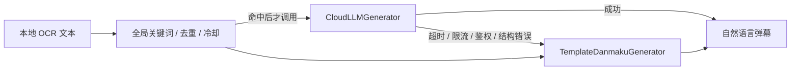

# 云端自然语言弹幕生成

## 定位

云端生成是关键词规则之后的可选层，不替代 OCR 和规则引擎。API 默认关闭，没有完整配置或用户主动停用时，系统继续使用本地模板。

## 安全与隐私

- Electron 主进程通过 Windows `safeStorage` 加密 API Key；Renderer 只能看到 `hasApiKey`，不能读取密钥正文。
- 系统加密不可用时，密钥只保存在本次进程内存，界面会明确警告。
- Python 只在内存中保存 Electron 同步的密钥，每个捕获会话使用启动时的配置快照。
- 云端请求只包含命中的 OCR 文本和本地模板结果，不包含截图、窗口标题或历史事件。
- 普通日志、WebSocket 事件和 SQLite 均不记录 API Key。

## 接口

所有接口继续使用 `X-DaMu-Token`：

- `PUT /api/v1/generation/config`：主进程同步配置和内存密钥。
- `POST /api/v1/generation/test`：使用“胜利”样例测试当前配置。

云端阶段为 `danmaku.created.payload` 增加兼容字段：

- `generator`: `cloud` 或 `template`。
- `generation_ms`: 生成耗时。
- `fallback_reason`: 回退时存在，例如 `timeout`、`rate_limited`、`authentication_failed`。
- `model`、`provider_request_id`: 云端成功时可选存在。

事件包的 `schema_version` 仍为 `1`，SQLite 不新增表。

## 使用方式

1. 停止当前捕获会话。
2. 在左侧 `CLOUD GENERATOR` 卡片点击“配置”。
3. 填写 OpenAI 兼容服务的 Base URL、API Key、模型名和系统提示词。
4. 点击“保存并测试‘胜利’”；测试不会启动捕获会话。
5. 启用云端生成，再启动真实窗口。
6. OCR 命中全局关键词后才会产生一次云端请求；失败时覆盖层仍显示本地模板弹幕。
